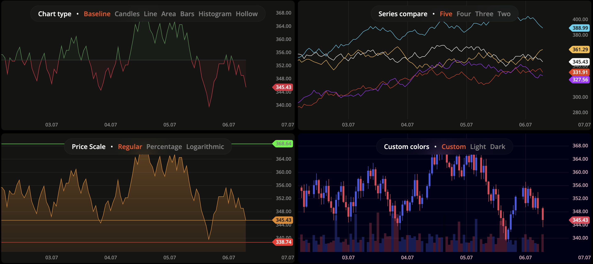
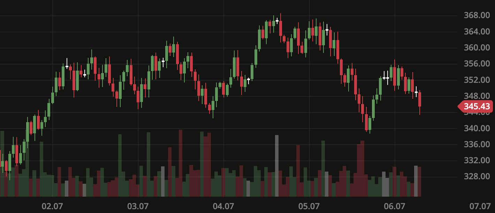

 <br>
<p align="center">
  
</p>

<h1 align="center">DXcharts Lite: Powerful financial charting tool</h1>

<p align="center">
  <i>
    DXcharts Lite is a modern solution for visualizing financial data with a wide variety of chart types.<br>
    Originally developed as part of large tradings applications used by millions of users,<br>
	  DXcharts Lite has matured into an independent product.<br>
    It can be used as a simple widget for blogs or as a component in enterprise trading solutions.<br>
  </i>
  <br>
</p>

<p align="center">
  <a href="https://opensource.org/licenses/MPL-2.0">
    
  </a>&nbsp;
  <a href="https://devexperts.com/kb/dxcharts/docs/how-to-contribute">
    
  </a>&nbsp;
  <a href="https://devexperts.com/dxcharts-demo/?lang=en">
    
  </a>
</p>

<br>

<p align="center">
  
</p>

<hr>

## Overview

Get started with DXcharts Lite by installing the library and configuring it to your needs.

-   🚀 [Quick start](#quick-start)
    -   📦 [Installation](#installation)
    -   🛠️ [Create Chart](#create-chart)
    -   📈 [Set data](#set-data)
    -   📄 [HTML markup](#html-markup)
-   ⚙️ [Configuration](#configuration)
-   🔌 [API](#api)
-   📒 [Examples](#examples)
-   🧮 [Demo](#demo)

## Quick-start

### Installation

Install the library in your project:

```js
npm install @devexperts/dxcharts-lite
```

Your `package.json` after installation:

```json
"dependencies": {
	"@devexperts/dxcharts-lite": "1.0.0",
	...
}
```

### Create chart

If you use webpack or another bundler, import the `createChart` method and pass the element where the chart will be rendered as the first argument.

```js
export const createChartInstance = () => {
	const container = document.getElementById('chart_container');
	const chartInstance = DXChart.createChart(container);
	return chartInstance;
};
```

The `createChart` method creates a new chart instance using `ChartBootstrap` class and returns it.

It accepts two parameters:

-   `element`: The HTML element where the chart will be rendered.
-   `config` (optional): An instance of [ChartConfig](/chart/chart-config/overview).

> Note: Set `width: 100%` and `height: 100%` for the parent container.
> By default, the chart auto-resizes to the parent, but you can change this by setting `fixedSize` in the config.

You should now see an empty chart on the screen.

### Set data

To display data (e.g. `Candles`), you can use the bundled function to generate mock data.
Import `generateCandlesData` and use it to generate candles.

```js
export const generateMockData = () => {
	const candles = generateCandlesData();
	chart.setData({ candles });
};
```

You should now see a basic chart like the image below:

<p align="center">
  
</p>

### HTML-markup

Here is complete quick-start code example:

```html
<html>
	<head>
		<script src="https://www.unpkg.com/@devexperts/dxcharts-lite@2.0.1/dist/dxchart.min.js"></script>
		<script type="importmap">
			{
				"imports": {
					"@devexperts/dxcharts-lite/": "https://www.unpkg.com/@devexperts/dxcharts-lite@2.0.1/"
				}
			}
		</script>
	</head>
	<body>
		<div id="chart_container"></div>
	</body>
	<script type="module">
		import generateCandlesData from '@devexperts/dxcharts-lite/dist/chart/utils/candles-generator.utils';

		// create chart instance, pass parent container as 1st argument
		const container = document.getElementById('chart_container');
		const chart = DXChart.createChart(container);
		// create and set candles data
		const candles = generateCandlesData();
		chart.setData({ candles });
	</script>
</html>
```

## Configuration

You can configure the chart using a `ChartConfig` object (optional).

`ChartConfig` sets the initial properties for the chart instance.
Below is a table of available options (see documentation for details).

-   [`FullChartConfig`](docs/generated/FullChartConfig.md)

## API

Each chart component has an API that allows you to change many parameters on the fly, modify appearance at runtime, and subscribe to various chart events (such as hovering over a candle).

Main components include:

-   [`ChartComponent`](docs/generated/ChartComponent.md): Set data, subscribe to data changes
-   [`XAxisComponent`](docs/generated/XAxisComponent.md): Configure x-axis labels
-   [`YAxisComponent`](docs/generated/YAxisComponent.md): Configure y-axis labels and type
-   [`CrossToolComponent`](docs/generated/CrossToolComponent.md): Crosshair type, OHLC magnet
-   [`EventsComponent`](docs/generated/EventsComponent.md): Set events data
-   [`VolumesComponent`](docs/generated/VolumesComponent.md): Set volume data
-   [`WaterMarkComponent`](docs/generated/WaterMarkComponent.md): Create and manage a watermark
-   [`NavigationMapComponent`](docs/generated/NavigationMapComponent.md): Create a navigation map
-   [`SnapshotComponent`](docs/generated/SnapshotComponent.md): Create a snapshot
-   [`HighlightsComponent`](docs/generated/HighlightsComponent.md): Draw highlights on canvas objects such as labels
-   [`PaneManager`](docs/generated/PaneManager.md): Create and manage panes
-   [`PaneComponent`](docs/generated/PaneComponent.md): Create and manage pane data series

## Examples

We have created many examples with different chart configurations.
You can find them [here](https://github.com/devexperts/dxcharts-lite/tree/master/docs/how-to).

## Demo

To demonstrate its capabilities, we've created a [Demo version](https://devexperts.com/dxcharts-demo/) based on DXcharts Lite.
Explore the full power of our library!
